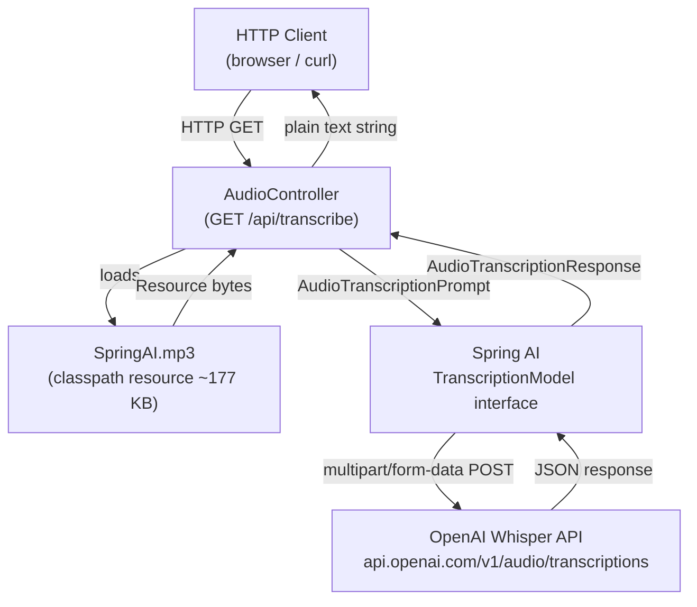

# Spring AI Transcription

A Spring Boot application that demonstrates audio-to-text transcription using the **Spring AI** framework. It exposes a single REST endpoint that transcribes a bundled MP3 audio file using OpenAI's Whisper API, abstracted behind Spring AI's `TranscriptionModel` interface.

---

## Table of Contents

1. [Overview](#1-overview)
2. [Key Features](#2-key-features)
3. [Technology Stack](#3-technology-stack)
4. [Prerequisites](#4-prerequisites)
5. [Configuration](#5-configuration)
6. [Project Structure](#6-project-structure)
7. [Architecture](#7-architecture)
8. [Transcription Pipeline Details](#8-transcription-pipeline-details)
9. [Detailed Execution Flow](#9-detailed-execution-flow)
10. [API Documentation](#10-api-documentation)
11. [Core Components and Classes](#11-core-components-and-classes)
12. [Spring AI Details](#12-spring-ai-details)
13. [Running the Application](#13-running-the-application)
14. [Example Usage](#14-example-usage)
15. [Testing](#15-testing)
16. [Error Handling](#16-error-handling)
17. [Security Considerations](#17-security-considerations)
18. [Design Decisions](#18-design-decisions)
19. [Limitations and Known Issues](#19-limitations-and-known-issues)
20. [Possible Improvements](#20-possible-improvements)
21. [Troubleshooting](#21-troubleshooting)
22. [Learning Notes / Key Takeaways](#22-learning-notes--key-takeaways)
23. [Glossary](#23-glossary)
24. [References](#24-references)
25. [License](#25-license)

---

## 1. Overview

**Problem**: Converting audio content to text (transcription) typically requires integrating directly with a cloud provider SDK — handling authentication, serialization, and API differences manually.

**Purpose**: This project demonstrates how the Spring AI abstraction layer simplifies audio transcription. Instead of calling OpenAI's raw REST API, Spring AI's `TranscriptionModel` interface handles all low-level communication, letting application code stay provider-agnostic in its API contract.

**Use Case**: Developer learning exercise / proof-of-concept. It shows how to wire Spring AI's transcription model into a Spring Boot controller and call OpenAI Whisper to convert speech to text.

**What the application does, end to end**:
1. Application starts and Spring AI auto-configures a `TranscriptionModel` bean backed by OpenAI Whisper.
2. A client calls `GET /api/transcribe`.
3. The controller loads a bundled MP3 file (`SpringAI.mp3`) from the classpath.
4. Spring AI sends the audio bytes to OpenAI's Whisper transcription endpoint.
5. The API returns the transcribed text, which the controller returns directly to the HTTP client as a plain string.

---

## 2. Key Features

These are the features that are **actually implemented** in the codebase:

- Single REST endpoint (`GET /api/transcribe`) that triggers transcription.
- Transcription of a pre-bundled MP3 file (`src/main/resources/SpringAI.mp3`, ~177 KB).
- Spring AI abstraction: the controller depends on `TranscriptionModel`, not an OpenAI-specific class.
- Configuration-driven API key via environment variable (`OPENAI_API_KEY`).
- Colored/formatted console logging via `logging.pattern.console`.
- Spring AI advisor debug logging enabled.

> Note: A `TextToSpeechModel` is also injected in the controller but **no TTS endpoint exists**. See [Limitations](#19-limitations-and-known-issues).

---

## 3. Technology Stack

| Component | Artifact / Version | Purpose |
|---|---|---|
| Language | Java 17 | Minimum required by Spring Boot 4.x |
| Framework | Spring Boot 4.1.1 | Application container and auto-configuration |
| AI Abstraction | Spring AI 2.0.1 (BOM) | Vendor-neutral AI model interfaces |
| AI Provider | OpenAI Whisper (via `spring.ai.openai.api-key`) | Audio transcription backend |
| Build Tool | Apache Maven 3.9.16 (via wrapper) | Dependency management and build |
| Web Layer | `spring-boot-starter-webmvc` | Embedded Tomcat + Spring MVC REST |
| Dev Tooling | `spring-boot-devtools` | Hot reload during development |
| Test Framework | `spring-boot-starter-webmvc-test` | Spring MVC test slice (JUnit 5) |

**Declared Maven dependency for AI model** (from `pom.xml`):
```xml
<dependency>
    <groupId>org.springframework.ai</groupId>
    <artifactId>spring-ai-starter-model-anthropic</artifactId>
</dependency>
```

> **Important discrepancy**: `pom.xml` declares the Anthropic starter, but `application.properties` configures an OpenAI API key. See [Limitations](#19-limitations-and-known-issues) for a full explanation of this mismatch.

---

## 4. Prerequisites

- **Java 17+** installed and on the `PATH` (check: `java -version`)
- **OpenAI API key** with access to the Whisper transcription endpoint
- Internet access to reach `api.openai.com`
- No Docker or external database required

---

## 5. Configuration

### Environment Variables

| Variable | Description | Example |
|---|---|---|
| `OPENAI_API_KEY` | OpenAI API key used by Spring AI to authenticate with OpenAI Whisper | `sk-proj-xxxx...` |

### `application.properties` (full file content)

```properties
spring.application.name=transcription-project
logging.pattern.console=%green(%d{HH:mm:ss.SSS}) %blue(%-5level) %red([%thread]) %yellow(%logger{15}) - %msg%n
logging.level.org.springframework.ai.chat.client.advisor=DEBUG
spring.ai.openai.api-key=${OPENAI_API_KEY}
```

### Key Configuration Details

| Property | Value | Explanation |
|---|---|---|
| `spring.application.name` | `transcription-project` | Spring application name |
| `logging.pattern.console` | ANSI colour pattern | Coloured output: timestamp=green, level=blue, thread=red, logger=yellow |
| `logging.level.org.springframework.ai.chat.client.advisor` | `DEBUG` | Verbose Spring AI advisor logs (useful for diagnosing prompt/response cycles) |
| `spring.ai.openai.api-key` | `${OPENAI_API_KEY}` | Reads OpenAI key from environment variable at startup |

**No Whisper model name is explicitly configured** in `application.properties`. Spring AI uses its default, which is `whisper-1`.

---

## 6. Project Structure

```
spring-ai-transcription/
├── .mvn/
│   └── wrapper/
│       └── maven-wrapper.properties       # Maven 3.9.16 wrapper config
├── src/
│   ├── main/
│   │   ├── java/
│   │   │   └── com/springai/transcriptionproject/
│   │   │       ├── TranscriptionProjectApplication.java   # Spring Boot entry point
│   │   │       └── controller/
│   │   │           └── AudioController.java               # REST controller (only source file)
│   │   └── resources/
│   │       ├── application.properties                     # App config (API key, logging)
│   │       └── SpringAI.mp3                               # Bundled sample audio (~177 KB)
│   └── test/
│       └── java/
│           └── com/springai/transcriptionproject/
│               └── TranscriptionProjectApplicationTests.java  # Context load test only
├── .gitignore
├── .gitattributes
├── mvnw                                                   # Maven wrapper (Unix)
├── mvnw.cmd                                               # Maven wrapper (Windows)
└── pom.xml
```

---

## 7. Architecture



---

## 8. Transcription Pipeline Details

### 8.1 Input Audio Format

- **Format**: MP3 (`SpringAI.mp3`)
- **Location**: `src/main/resources/` — bundled inside the JAR as a classpath resource
- **Size**: ~180,960 bytes (~177 KB)
- **Injection mechanism**: Spring's `@Value("classpath:SpringAI.mp3") Resource audioFile` on the method parameter

The audio input is **not dynamic** — it is a fixed file included in the compiled artifact. There is no HTTP file upload endpoint.

### 8.2 Upload / Request Flow

```
Client              Controller              Spring AI              OpenAI
  |                     |                       |                     |
  |-- GET /api/transcribe -->|                  |                     |
  |                     |-- loads SpringAI.mp3  |                     |
  |                     |-- new AudioTranscriptionPrompt(audioFile) ->|
  |                     |                       |-- POST multipart --> |
  |                     |                       |<-- JSON transcript --|
  |                     |<-- AudioTranscriptionResponse               |
  |<-- 200 plain text --|                       |                     |
```

### 8.3 Audio Processing

No pre-processing is performed on the audio before sending it to OpenAI. The Spring `Resource` object is passed directly to `AudioTranscriptionPrompt`. Spring AI internally reads the resource bytes and encodes them in a `multipart/form-data` body.

### 8.4 Transcription Model / Provider

| Aspect | Detail |
|---|---|
| Provider | OpenAI (configured via `spring.ai.openai.api-key`) |
| Model | Whisper v1 (Spring AI default; not explicitly overridden in config) |
| API Endpoint | `POST https://api.openai.com/v1/audio/transcriptions` |
| Spring AI Interface | `org.springframework.ai.audio.transcription.TranscriptionModel` |

### 8.5 Configuration Options (Spring AI)

No custom `OpenAiAudioTranscriptionOptions` are passed. Spring AI uses defaults:
- Model: `whisper-1`
- Response format: `json` (returns the `text` field)
- Language: auto-detected by Whisper

To override defaults, an `OpenAiAudioTranscriptionOptions` bean can be passed as the second argument to `AudioTranscriptionPrompt`.

### 8.6 Response Format

The endpoint returns a **plain text `String`** (HTTP `200 OK`, `Content-Type: text/plain`).

Example response:
```
Spring AI is a powerful framework that simplifies integration with AI models...
```

The actual content depends on the audio in `SpringAI.mp3`.

### 8.7 Error Handling

No explicit error handling is implemented. If the OpenAI call fails (wrong API key, network error, rate limit), Spring Boot will return a `500 Internal Server Error` with the exception stack trace in the response body (default Spring MVC behavior with no `@ControllerAdvice`).

### 8.8 Supported Audio Formats

The controller hard-codes MP3 input. OpenAI Whisper itself supports: `flac`, `m4a`, `mp3`, `mp4`, `mpeg`, `mpga`, `oga`, `ogg`, `wav`, `webm`. No validation of file type is performed in the application.

### 8.9 Size Limitations

OpenAI Whisper enforces a **25 MB file size limit** per request. The bundled `SpringAI.mp3` (~177 KB) is well within that limit. No size checking is done in application code.

---

## 9. Detailed Execution Flow

```
1. Application Startup
   └── Spring Boot auto-configures:
       └── TranscriptionModel bean (backed by OpenAI Whisper, using spring.ai.openai.api-key)
       └── TextToSpeechModel bean (injected into controller but unused)
       └── AudioController (constructor injection of both models)

2. GET /api/transcribe is called
   └── Spring MVC resolves AudioController.transcribe()
   └── @Value("classpath:SpringAI.mp3") injects the Resource
   └── new AudioTranscriptionPrompt(audioFile) wraps the resource
   └── transcriptionModel.call(prompt) is invoked

3. Spring AI sends to OpenAI
   └── Reads bytes from the Resource
   └── POST https://api.openai.com/v1/audio/transcriptions
       ├── Header: Authorization: Bearer <your-key>
       ├── Body: multipart/form-data
       │     ├── file: <audio bytes>
       │     └── model: whisper-1

4. OpenAI Whisper processes audio
   └── Returns JSON: { "text": "transcribed text here" }

5. Spring AI unwraps response
   └── AudioTranscriptionResponse wraps the result
   └── response.getResult().getOutput() extracts the String

6. Controller returns the String
   └── Spring MVC serializes to text/plain
   └── HTTP 200 returned to client
```

---

## 10. API Documentation

### Endpoints

#### `GET /api/transcribe`

Transcribes the bundled `SpringAI.mp3` file using OpenAI Whisper.

| Attribute | Value |
|---|---|
| Method | `GET` |
| Path | `/api/transcribe` |
| Request Body | None |
| Query Parameters | None |
| Path Variables | None |
| Request Headers | None required |
| Response Type | `text/plain` |
| Success Status | `200 OK` |
| Error Status | `500 Internal Server Error` (no explicit error handling) |

**Response Example:**
```
This is Spring AI, the framework that brings artificial intelligence capabilities to your Spring Boot applications...
```

> There is only one endpoint in the entire project. No file upload endpoint exists.

---

## 11. Core Components and Classes

### `TranscriptionProjectApplication.java`

```
Package: com.springai.transcriptionproject
```

Standard Spring Boot entry point. Annotated with `@SpringBootApplication`. Contains only `main(String[] args)` calling `SpringApplication.run(...)`. No custom beans, no custom configuration.

---

### `AudioController.java`

```
Package: com.springai.transcriptionproject.controller
```

The only REST controller in the application.

**Class-level annotations:**
- `@RestController` — marks this as a controller where every method returns a response body
- `@RequestMapping("/api")` — all endpoints prefixed with `/api`

**Constructor-injected dependencies:**
- `TranscriptionModel transcriptionModel` — Spring AI interface for audio-to-text
- `TextToSpeechModel textToSpeechModel` — Spring AI interface for text-to-audio (injected but no endpoint uses it)

**Method:**

```java
@GetMapping("/transcribe")
String transcribe(@Value("classpath:SpringAI.mp3") Resource audioFile)
```

- `@GetMapping("/transcribe")` — maps to `GET /api/transcribe`
- `@Value("classpath:SpringAI.mp3")` on the method parameter — Spring resolves the classpath resource and injects it as a `Resource`
- Creates `AudioTranscriptionPrompt(audioFile)` — wraps the resource
- Calls `transcriptionModel.call(prompt)` — delegates to Spring AI
- Returns `response.getResult().getOutput()` — the transcribed plain text string

---

### `TranscriptionProjectApplicationTests.java`

```
Package: com.springai.transcriptionproject
```

Auto-generated Spring Boot test. Only tests that the Spring context loads without errors (`contextLoads()`). No behavioral tests exist.

---

## 12. Spring AI Details

### Key Interfaces Used

| Interface / Class | Package | Purpose |
|---|---|---|
| `TranscriptionModel` | `org.springframework.ai.audio.transcription` | Top-level interface; wraps any transcription provider |
| `AudioTranscriptionPrompt` | `org.springframework.ai.audio.transcription` | Input container; wraps the audio `Resource` and optional options |
| `AudioTranscriptionResponse` | `org.springframework.ai.audio.transcription` | Output container returned by `TranscriptionModel.call()` |
| `TextToSpeechModel` | `org.springframework.ai.audio.tts` | Interface for TTS (injected but unused in any endpoint) |

### How `AudioTranscriptionPrompt` Works

```java
// Minimal usage (no custom options):
AudioTranscriptionPrompt prompt = new AudioTranscriptionPrompt(audioFile);

// With options (not used in this project, shown for reference):
AudioTranscriptionPrompt prompt = new AudioTranscriptionPrompt(
    audioFile,
    OpenAiAudioTranscriptionOptions.builder()
        .withModel("whisper-1")
        .withLanguage("en")
        .withResponseFormat(OpenAiAudioApi.TranscriptResponseFormat.TEXT)
        .build()
);
```

### Spring AI Auto-Configuration

Spring AI's auto-configuration reads `spring.ai.openai.api-key` from `application.properties` and automatically creates the `TranscriptionModel` bean. No `@Bean` or `@Configuration` class is needed in the application.

### Declared vs Required Dependency

The `pom.xml` declares:
```xml
<dependency>
    <groupId>org.springframework.ai</groupId>
    <artifactId>spring-ai-starter-model-anthropic</artifactId>
</dependency>
```

The Anthropic starter (`spring-ai-starter-model-anthropic`) provides Spring AI support for Anthropic's Claude models (text chat), **not** OpenAI Whisper audio transcription. For audio transcription via OpenAI, the correct dependency is:
```xml
<dependency>
    <groupId>org.springframework.ai</groupId>
    <artifactId>spring-ai-starter-model-openai</artifactId>
</dependency>
```

This discrepancy is the primary blocker preventing the application from running as written. See [Limitations](#19-limitations-and-known-issues) for full details.

---

## 13. Running the Application

### Step 1: Set the Environment Variable

**Linux / macOS / Git Bash:**
```bash
export OPENAI_API_KEY=sk-proj-your-openai-api-key-here
```

**Windows CMD:**
```cmd
set OPENAI_API_KEY=sk-proj-your-openai-api-key-here
```

**Windows PowerShell:**
```powershell
$env:OPENAI_API_KEY = "sk-proj-your-openai-api-key-here"
```

### Step 2: Fix the pom.xml (Required)

Replace the Anthropic dependency with the OpenAI starter in `pom.xml`:

```xml
<!-- REMOVE this: -->
<dependency>
    <groupId>org.springframework.ai</groupId>
    <artifactId>spring-ai-starter-model-anthropic</artifactId>
</dependency>

<!-- ADD this: -->
<dependency>
    <groupId>org.springframework.ai</groupId>
    <artifactId>spring-ai-starter-model-openai</artifactId>
</dependency>
```

### Step 3: Build and Run

```bash
# Using the included Maven wrapper (recommended):
./mvnw spring-boot:run          # Linux / macOS / Git Bash
mvnw.cmd spring-boot:run        # Windows CMD

# Or build a JAR first:
./mvnw clean package
java -jar target/transcription-project-0.0.1-SNAPSHOT.jar
```

The server starts on port **8080** by default (no `server.port` override in config).

### Step 4: Call the Endpoint

```bash
curl http://localhost:8080/api/transcribe
```

---

## 14. Example Usage

### Basic transcription call

```bash
curl http://localhost:8080/api/transcribe
```

**Expected response** (HTTP 200, Content-Type: text/plain):
```
Spring AI is an application framework for AI engineering...
```

### Verbose call to see HTTP status

```bash
curl -v http://localhost:8080/api/transcribe
```

### Save transcript to a file

```bash
curl http://localhost:8080/api/transcribe -o transcript.txt
```

> Note: There is no file upload endpoint. All calls transcribe the same bundled `SpringAI.mp3`. To transcribe a different file, you must replace `src/main/resources/SpringAI.mp3` and rebuild.

---

## 15. Testing

The project contains only one test class: `TranscriptionProjectApplicationTests.java`.

```java
@SpringBootTest
class TranscriptionProjectApplicationTests {
    @Test
    void contextLoads() {
    }
}
```

This is the auto-generated Spring Boot test. It verifies only that the application context starts without errors.

**There are no behavioral tests, no unit tests for `AudioController`, and no integration tests that call the `/api/transcribe` endpoint.**

Running tests:
```bash
./mvnw test
```

> Note: Running `contextLoads()` will attempt to start the full application context, which requires `OPENAI_API_KEY` to be set and the correct Maven dependency to be present.

---

## 16. Error Handling

No explicit error handling is implemented in the application. The following table describes what happens in failure scenarios:

| Scenario | Result |
|---|---|
| `OPENAI_API_KEY` not set | Application fails to start: `IllegalArgumentException` on property resolution |
| OpenAI API returns 401 Unauthorized | Spring AI throws an exception; Spring returns `500 Internal Server Error` |
| OpenAI API rate limit hit (429) | Spring AI throws an exception; Spring returns `500 Internal Server Error` |
| Network timeout reaching OpenAI | Spring AI throws an exception; Spring returns `500 Internal Server Error` |
| `SpringAI.mp3` missing from classpath | `FileNotFoundException` at runtime; `500 Internal Server Error` |
| Wrong Maven dependency (Anthropic starter) | `NoSuchBeanDefinitionException` for `TranscriptionModel` at startup |

No `@ControllerAdvice` or `@ExceptionHandler` is present. Spring Boot's default error response format (`/error` endpoint with JSON body) would apply.

---

## 17. Security Considerations

This is a **development / learning project** and has no production security measures. Key considerations if this were to be deployed:

- **API Key Exposure**: `spring.ai.openai.api-key=${OPENAI_API_KEY}` reads from environment variable correctly — the key is not hardcoded. Do not commit a `.env` file or log the key.
- **No Authentication**: The `/api/transcribe` endpoint is publicly accessible. Any caller can trigger an OpenAI API call, incurring cost on the owner's account.
- **No File Upload Validation**: The application uses a fixed classpath resource, so there is no file upload attack surface at present. If a file upload endpoint were added, MIME type and size validation would be needed.
- **No Rate Limiting**: No rate limiting on the endpoint. Repeated calls will exhaust the OpenAI API quota.
- **No HTTPS**: No TLS configuration. Not suitable for production without a reverse proxy.

---

## 18. Design Decisions

| Decision | Rationale (inferred) |
|---|---|
| Fixed classpath MP3 instead of file upload | Simplicity for a learning project; removes multipart handling complexity |
| `@Value` on method parameter (not field) | Demonstrates Spring's ability to inject values at the method level, not just fields |
| `TranscriptionModel` interface (not `OpenAiAudioTranscriptionModel` directly) | Follows Spring AI's design: depend on the abstraction, not the implementation |
| GET endpoint for transcription | Simplest HTTP method for a demo — no body handling; not RESTfully correct (should be POST for actions with side effects) |
| No custom `AudioTranscriptionOptions` | Accepts all Whisper defaults; sufficient for a proof-of-concept |
| Colored console logging | Developer ergonomics during local development |
| `TextToSpeechModel` injected but unused | Suggests an intent to add a TTS endpoint that was never implemented |

---

## 19. Limitations and Known Issues

### Critical: Maven Dependency Mismatch

**This is the primary issue preventing the project from running as committed.**

The `pom.xml` declares `spring-ai-starter-model-anthropic`, which provides Spring AI support for Anthropic Claude models (text generation). It does **not** provide:
- `TranscriptionModel` bean
- `TextToSpeechModel` bean

However, the application requires both of these beans (both are constructor-injected into `AudioController`). Also, `application.properties` configures `spring.ai.openai.api-key`, which is irrelevant to the Anthropic starter.

The correct dependency for OpenAI Whisper transcription is `spring-ai-starter-model-openai`.

**Impact**: The application context will fail to start with a `NoSuchBeanDefinitionException` because `TranscriptionModel` and `TextToSpeechModel` beans are not registered.

**Fix**: Replace `spring-ai-starter-model-anthropic` with `spring-ai-starter-model-openai` in `pom.xml`.

---

### Other Limitations

| Limitation | Details |
|---|---|
| No file upload endpoint | Only the hardcoded `SpringAI.mp3` can be transcribed. To use a different file, you must replace the resource and rebuild. |
| `TextToSpeechModel` injected but no TTS endpoint | The `textToSpeechModel` field is set in the constructor but is never called. It is dead code at present. |
| No dynamic audio format support | Only the bundled MP3 is supported. No logic to handle different formats conditionally. |
| No async processing | `transcriptionModel.call()` is synchronous. For large files or high concurrency, this blocks the servlet thread. |
| No pagination or streaming | The transcript is returned as a single string. No streaming or chunked response. |
| Context loads test requires real API key | Running `mvn test` will fail without `OPENAI_API_KEY` set, because `@SpringBootTest` starts the full context. |
| GET method for a state-changing operation | Calling an external paid API via GET is not idempotent in the REST sense; should be POST. |

---

## 20. Possible Improvements

| Improvement | Description |
|---|---|
| Fix Maven dependency | Replace `spring-ai-starter-model-anthropic` with `spring-ai-starter-model-openai` |
| Add file upload endpoint | `POST /api/transcribe` accepting `multipart/form-data` with a `file` part, replacing the hardcoded resource |
| Implement TTS endpoint | Add `POST /api/speak` that calls `TextToSpeechModel` with a text input and returns audio bytes |
| Add `@ControllerAdvice` | Catch Spring AI exceptions and return structured JSON error responses (400/401/429/500) |
| Configure Whisper options | Accept `language` and `response_format` as query parameters and pass them through `OpenAiAudioTranscriptionOptions` |
| Add Spring Security | Add basic auth or API key header validation to protect the endpoint from unauthorized callers |
| Add async support | Use `@Async` or Spring WebFlux to avoid blocking the servlet thread during long transcription calls |
| Add file type validation | Check MIME type and file extension before sending to OpenAI |
| Add size limit validation | Reject files over 25 MB before calling OpenAI (fail fast) |
| Write real tests | Mock `TranscriptionModel` with `@MockBean` and write unit tests for `AudioController` |
| Add `@Profile`-based config | Separate dev/prod profiles; use `spring.ai.openai.api-key` placeholder in prod |

---

## 21. Troubleshooting

### Application fails to start: `NoSuchBeanDefinitionException`

```
NoSuchBeanDefinitionException: No qualifying bean of type 
'org.springframework.ai.audio.transcription.TranscriptionModel' available
```

**Cause**: The Anthropic starter (`spring-ai-starter-model-anthropic`) does not provide a `TranscriptionModel` bean.

**Fix**: Replace in `pom.xml`:
```xml
<!-- Old (incorrect for audio transcription): -->
<dependency>
    <groupId>org.springframework.ai</groupId>
    <artifactId>spring-ai-starter-model-anthropic</artifactId>
</dependency>

<!-- New (correct): -->
<dependency>
    <groupId>org.springframework.ai</groupId>
    <artifactId>spring-ai-starter-model-openai</artifactId>
</dependency>
```

---

### `IllegalArgumentException: Could not resolve placeholder 'OPENAI_API_KEY'`

**Cause**: Environment variable `OPENAI_API_KEY` is not set.

**Fix**: Set the environment variable before running:
```bash
export OPENAI_API_KEY=sk-proj-...
```

---

### `401 Unauthorized` from OpenAI

**Cause**: The API key is set but is invalid, expired, or does not have access to the `whisper-1` model.

**Fix**: Verify the key at [https://platform.openai.com/api-keys](https://platform.openai.com/api-keys).

---

### `429 Too Many Requests`

**Cause**: OpenAI rate limit exceeded.

**Fix**: Wait and retry. Consider adding retry logic with exponential backoff.

---

### `ClassNotFoundException` for a Spring AI class

**Cause**: Spring AI 2.0.1 requires Spring Boot 4.x and Java 17+. If running on Java 11 or Spring Boot 3.x, class names may differ.

**Fix**: Ensure `java -version` returns 17+ and the Spring Boot parent is `4.1.1` as in `pom.xml`.

---

## 22. Learning Notes / Key Takeaways

This project illustrates several Spring AI and Spring Boot concepts:

1. **Spring AI Model Abstraction**: By depending on `TranscriptionModel` (interface) instead of `OpenAiAudioTranscriptionModel` (concrete class), the controller is decoupled from the provider. Switching from OpenAI to another future provider would only require a configuration change.

2. **`@Value` on Method Parameters**: Spring's `@Value` annotation can resolve classpath resources at the method level, not just field level. This is a lesser-known feature of Spring's expression language.

3. **Spring AI BOM**: Using `spring-ai-bom` in `<dependencyManagement>` with `import` scope centralizes Spring AI version management — all Spring AI starters inherit the correct version automatically.

4. **Auto-Configuration for AI Models**: Spring AI follows the same auto-configuration convention as Spring Data or Spring Security — declare the starter dependency and set the API key property; no `@Bean` definitions needed.

5. **`AudioTranscriptionPrompt` as a Value Object**: The `AudioTranscriptionPrompt` is a simple value object wrapping the input resource and optional options — a clean API design pattern.

6. **The Dependency-Config Mismatch Pattern**: This project is an educational example of what happens when the Maven dependency (`spring-ai-starter-model-anthropic`) does not match the runtime configuration (`spring.ai.openai.api-key`). The `NoSuchBeanDefinitionException` at startup would be the first signal.

---

## 23. Glossary

| Term | Definition |
|---|---|
| **Spring AI** | An open-source Spring framework project that provides a vendor-neutral API for interacting with AI models (LLMs, image generation, audio, embeddings, etc.) |
| **TranscriptionModel** | Spring AI interface that abstracts audio-to-text conversion; implemented by providers like OpenAI |
| **TextToSpeechModel** | Spring AI interface that abstracts text-to-audio conversion |
| **AudioTranscriptionPrompt** | Spring AI value object wrapping a `Resource` (audio file) and optional transcription options |
| **AudioTranscriptionResponse** | Spring AI response object; call `.getResult().getOutput()` to get the transcribed `String` |
| **Whisper** | OpenAI's open-source speech recognition model; accessible via `POST /v1/audio/transcriptions` |
| **Spring AI BOM** | Bill of Materials — a POM artifact that locks all Spring AI dependency versions to a compatible set |
| **`spring-ai-starter-model-openai`** | The Spring AI starter that auto-configures OpenAI-backed chat, embedding, image, TTS, and transcription models |
| **`spring-ai-starter-model-anthropic`** | The Spring AI starter that auto-configures Anthropic Claude-backed chat models only (no audio) |
| **`@Value` on method parameter** | Spring annotation that resolves a property/resource expression and injects it as a method argument |
| **classpath resource** | A file bundled inside the JAR under `src/main/resources/`, accessible via `classpath:filename` |
| **multipart/form-data** | HTTP content type used for sending binary files (like audio) in HTTP request bodies |

---

## 24. References

- [Spring AI Documentation — Audio Transcription](https://docs.spring.io/spring-ai/reference/api/audio/transcriptions/openai-transcriptions.html)
- [Spring AI GitHub Repository](https://github.com/spring-projects/spring-ai)
- [OpenAI Whisper API Reference](https://platform.openai.com/docs/api-reference/audio/createTranscription)
- [OpenAI Whisper Model Overview](https://platform.openai.com/docs/models/whisper)
- [Spring Boot 4.1.1 Release Notes](https://github.com/spring-projects/spring-boot/releases/tag/v4.1.1)
- [Spring AI BOM — Maven Central](https://central.sonatype.com/artifact/org.springframework.ai/spring-ai-bom)
- [Spring `@Value` Annotation Reference](https://docs.spring.io/spring-framework/docs/current/javadoc-api/org/springframework/beans/factory/annotation/Value.html)

---

## 25. License

No license file is present in this repository. All rights are reserved by the author by default. Contact the repository owner for usage permissions.

---


